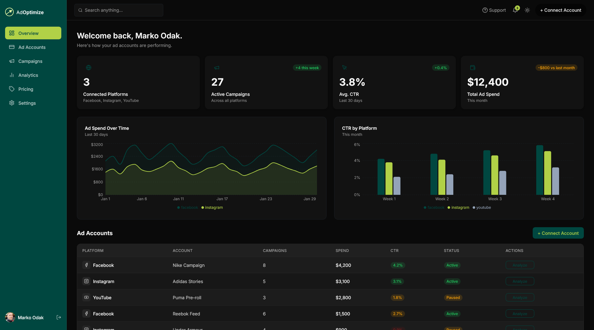

# AdOptimize — AI-Powered Ad Optimization SaaS

> Scale your Facebook, Instagram and YouTube ads 
> smarter, faster and safer — with AI-powered 
> insights in one clean, conversion-focused dashboard.



---

## 🚀 Live Demo

🔗 [adoptimize-030ba79e.vercel.app](https:// https://adoptimize-030ba79e.vercel.app/)

---

## 📌 What is AdOptimize?

AdOptimize is a full-stack SaaS application built 
for digital marketing agencies and performance 
marketers who manage ad campaigns across multiple 
platforms.

Instead of switching between Facebook Ads Manager, 
Google Ads, and YouTube Studio, AdOptimize brings 
everything into a single, clean dashboard — powered 
by AI analysis that delivers instant, actionable 
recommendations for every ad account.

---

## ✨ Key Features

- **AI-Powered Analysis** — Click "Analyze" on any 
  ad account to receive instant GPT-powered 
  recommendations prioritized by impact
- **Multi-Platform Dashboard** — Facebook, Instagram 
  and YouTube ad accounts in one unified view
- **Real-Time Analytics** — Impressions, CTR, 
  conversions and spend tracking with interactive 
  charts
- **Campaign Management** — Full campaign overview 
  with platform, budget, spend and status tracking
- **Secure Authentication** — Email/password and 
  Google OAuth via Supabase Auth
- **Light/Dark Theme** — Fully functional theme 
  toggle across all pages
- **Notifications System** — Real-time performance 
  alerts with mark-as-read functionality
- **Pricing Plans** — Three-tier pricing (Starter, 
  Pro, Agency) with annual/monthly toggle
- **Stripe Ready** — Pricing UI fully built and 
  ready for Stripe subscription integration
- **Responsive Design** — Optimized for desktop, 
  tablet and mobile

---

## 🛠 Tech Stack

### Frontend
| Technology | Purpose |
|---|---|
| React + TypeScript | UI framework |
| Vite | Build tool |
| Tailwind CSS | Styling |
| shadcn/ui | Component library |
| Recharts | Data visualization |
| React Router | Client-side routing |
| Lucide React | Icon library |

### Backend & Infrastructure
| Technology | Purpose |
|---|---|
| Supabase | Database, Auth, Edge Functions |
| PostgreSQL | Primary database |
| Row Level Security | Data access control |
| Supabase Edge Functions | Serverless API layer |
| Deno | Edge Function runtime |

### AI & APIs
| Technology | Purpose |
|---|---|
| OpenAI GPT-5 mini | Ad analysis engine |
| OpenAI Chat Completions API | AI recommendations |

### Deployment
| Technology | Purpose |
|---|---|
| Vite + Custom Domain | Frontend hosting |
| Supabase Cloud | Backend hosting |
| GitHub | Version control |

---

## 🏗 Architecture
```
┌─────────────────────────────────────┐
│           React Frontend            │
│     (Vite + TypeScript)   │
└──────────────┬──────────────────────┘
               │
               ▼
┌─────────────────────────────────────┐
│         Supabase Platform           │
│                                     │
│  ┌─────────┐  ┌──────────────────┐  │
│  │  Auth   │  │   PostgreSQL DB  │  │
│  │ (email  │  │   (4 tables +    │  │
│  │ + OAuth)│  │      RLS)        │  │
│  └─────────┘  └──────────────────┘  │
│                                     │
│  ┌──────────────────────────────┐   │
│  │      Edge Functions          │   │
│  │  analyze-ad-account          │   │
│  │  (Deno + OpenAI API)         │   │
│  └──────────────────────────────┘   │
└─────────────────────────────────────┘
               │
               ▼
┌─────────────────────────────────────┐
│         OpenAI API                  │
│         GPT-5 mini                  │
│   (Ad performance analysis)         │
└─────────────────────────────────────┘
```

---

## 📁 Project Structure
```
adoptimize/
├── public/
│   └── images/          # App screenshots + assets
├── src/
│   ├── components/
│   │   ├── dashboard/   # Dashboard components
│   │   └── landing/     # Landing page sections
│   ├── pages/
│   │   ├── Landing.tsx  # Public landing page
│   │   ├── Login.tsx    # Auth pages
│   │   ├── Signup.tsx
│   │   ├── Dashboard.tsx
│   │   ├── AdAccounts.tsx
│   │   ├── Campaigns.tsx
│   │   ├── Analytics.tsx
│   │   ├── Pricing.tsx
│   │   └── Settings.tsx
│   └── integrations/
│       └── supabase/    # Supabase client + types
└── supabase/
    └── functions/
        └── analyze-ad-account/
            └── index.ts # OpenAI Edge Function
```

---

## 🗄 Database Schema
```sql
-- Users (managed by Supabase Auth)
auth.users

-- Ad Accounts
ad_accounts (
  id, user_id, platform, 
  account_name, status, created_at
)

-- Campaigns
campaigns (
  id, ad_account_id, user_id,
  name, budget, spent, 
  status, created_at
)

-- AI Analyses
analyses (
  id, ad_account_id, user_id,
  recommendations, created_at
)

-- Plans
plans (
  id, name, price_monthly,
  price_annual, features
)
```

*All tables protected with Row Level Security (RLS)*

---

## 🤖 AI Analysis Flow
```
User clicks "Analyze" button
         │
         ▼
Frontend sends POST request to
Supabase Edge Function with:
  - accountName
  - platform  
  - spend, impressions
  - clicks, conversions
         │
         ▼
Edge Function calculates:
  - CTR, CPC, Conversion Rate
         │
         ▼
OpenAI GPT-5 mini analyzes metrics
and returns 3-5 prioritized
actionable recommendations
         │
         ▼
Recommendations displayed in
modal with copy-to-clipboard
```

---

## 🔐 Authentication Flow
```
Public routes:    /  /login  /signup  /pricing
Protected routes: /dashboard  /ad-accounts
                  /campaigns  /analytics  /settings

Logged-in users visiting public routes
→ Auto-redirected to /dashboard

Logged-out users visiting protected routes  
→ Auto-redirected to /login
```

---

## 💳 Stripe Integration (Ready to Connect)

The complete pricing UI is built and production-ready with three subscription tiers:

| Plan | Price | Key Limit |
|---|---|---|
| Starter | Free | 2 accounts, 5 AI analyses/mo |
| Pro | $49/mo | 10 accounts, unlimited analyses |
| Agency | $149/mo | Unlimited everything, 5 team members |

**To activate Stripe:**
1. Create Stripe products matching the three tiers
2. Add a `stripe-webhook` Supabase Edge Function
3. Add `subscription_status` to the users table
4. Wire CTA buttons to Stripe Checkout

---

## 🚀 Running Locally

### Prerequisites
- Node.js 18+
- Git
- Supabase CLI

### Setup
```bash
# Clone the repository
git clone https://github.com/markoodakos/adoptimize-030ba79e.git
cd adoptimize-030ba79e

# Install dependencies
npm install

# Start development server
npm run dev
```

Open `http://localhost:8080` in your browser.

### Environment
Supabase credentials are configured directly 
in `src/integrations/supabase/client.ts` 

## 🗺 Roadmap

- [ ] Stripe subscription integration
- [ ] Facebook Ads API connection
- [ ] Google Ads API connection  
- [ ] YouTube Analytics API connection
- [ ] Real-time campaign performance alerts
- [ ] AI recommendation history/archive
- [ ] Team collaboration features
- [ ] White-label option for agencies
- [ ] Custom report generation
- [ ] Mobile app (React Native)

---

## 👤 About the Developer

**Marko Odak**
Founder & Developer, AdOptimize

Built by a developer who understands both 
the technical and strategic side of digital 
advertising. AdOptimize is designed to be 
the tool that was always missing.

🔗 [LinkedIn](https://linkedin.com/in/markoodak)
🐙 [GitHub](https://github.com/markoodakos)

---

## 📌 Status

AdOptimize is currently in active development.
Core features are live and functional.
Platform API integrations and Stripe 
billing are on the roadmap.

---
*Built with React, TypeScript, Supabase, and OpenAI.*
